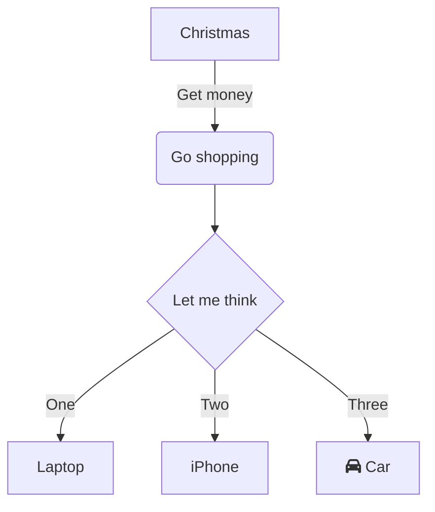
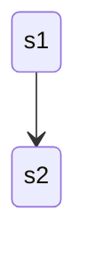
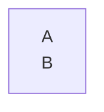

# Mermaid

```mermaid
flowchart TD
    A[Christmas] -->|Get money| B(Go shopping)
    B --> C{Let me think}
    C -->|One| D[Laptop]
    C -->|Two| E[iPhone]
    C -->|Three| F[fa:fa-car Car]
```

## regression: should render more than one diagram

```mermaid
stateDiagram
  s1-->s2
```

```mermaid
stateDiagram
  s1-->s2
```

## regression: should have a line break between A and B

```mermaid
graph TD
  A["A<br/>B"]
```
